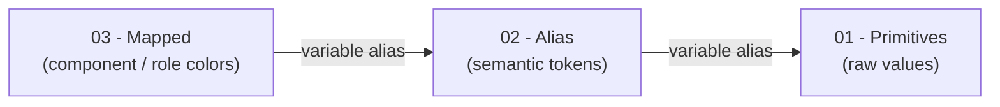

# BrianGPT — Figma design token structure

This document summarizes the **local variable collections** in the BrianGPT Figma file and how they chain together. Data was read from the file via the Figma Plugin API (variable collections, modes, variables, and alias targets).

**Source file:** [BrianGPT (Figma)](https://www.figma.com/design/mlYfMT6fTkpOn91clhFTxs/BrianGPT?node-id=83-1255&t=GtUsZwV8TOUYHgGv-1)

---

## Overview

The token system uses **three stacked collections** in order:

| Order | Collection          | Role                                                                                          |
| ----- | ------------------- | --------------------------------------------------------------------------------------------- |
| 1     | **01 - Primitives** | Raw design values (colors, numbers, strings). No references to other collections.             |
| 2     | **02 - Alias**      | Semantic tokens (e.g. `color/neutral/500`, `spacing/md`) that **alias** primitives.           |
| 3     | **03 - Mapped**     | **Semantic UI / component tokens** (mostly `color/...` paths) that **alias** the alias layer. |

**Repo source of truth:** `design-tokens/figma-variables.json` → `node design-tokens/build.mjs` → `design-tokens/tokens.css` and `public/design-tokens/tokens.css`. **Do not hand-edit the generated `tokens.css` files** — edits will be overwritten the next time someone runs the build and tokens will appear “deleted.” Add or change variables in the JSON, then regenerate.

**Mapped entries:** use `"ref": "--some-existing-var"` so the output is `name: var(--some-existing-var)`. For values that are not a single `var()` (e.g. **box-shadow** strings, **color-mix** expressions), use `"value": "…raw CSS…"` instead of `ref` (never both).

**Total local variables:** 186 (59 + 57 + 70).

---

## Collections and modes

| Collection      | Modes     | Notes                                                                                        |
| --------------- | --------- | -------------------------------------------------------------------------------------------- |
| 01 - Primitives | `Default` | Single mode.                                                                                 |
| 02 - Alias      | `Default` | Single mode.                                                                                 |
| 03 - Mapped     | `Mode 1`  | Single mode today; name differs from “Default” but behaves as the collection’s default mode. |

All tokens are **mode-specific** in Figma’s model; with one mode per collection, each variable has a single value per collection.

---

## Variable types by collection

### 01 - Primitives (59 variables)

| Resolved type | Count | Purpose (from naming)                                                                                               |
| ------------- | ----- | ------------------------------------------------------------------------------------------------------------------- |
| `COLOR`       | 19    | Palette steps, e.g. `neutral/`*, `orange/`*, plus `neutral/white`, `neutral/black`.                                 |
| `FLOAT`       | 34    | Mostly **scale** steps (`scale/0` …) used for spacing, radius, stroke; typography line heights and related numbers. |
| `STRING`      | 6     | Font-related strings (e.g. family / style primitives).                                                              |

**Primitive groups (top path segment):**

- **neutral** — 12 steps (`neutral/0` … `neutral/900`) plus white/black entries exposed as primitives.
- **orange** — 7 steps (`orange/100` … `orange/700`).
- **scale** — 22 numeric steps (spacing/radius/stroke foundation).
- **font** — 18 entries (sizes, line heights, weights, style).

Every primitive in **Default** mode holds a **raw** value (no variable aliases in this collection).

### 02 - Alias (57 variables)

| Resolved type | Count |
| ------------- | ----- |
| `COLOR`       | 19    |
| `FLOAT`       | 32    |
| `STRING`      | 6     |

Naming shifts to **semantic paths**, for example:

- `color/neutral/`*, `color/orange/`*
- `spacing/*`, `radius/*`, `stroke/*`
- `font/weight/*`, `font/size/*`, `font/line-height/*`

**Link to primitives:** In the **Default** mode, **56 of 57** alias variables resolve to **01 - Primitives**. The remaining variable is `**radius/full`**, which stores a **raw float** (`9999`) in the alias collection rather than aliasing a scale primitive—effectively a semantic “full pill” radius without a primitive step.

### 03 - Mapped (70 variables)

| Resolved type | Count |
| ------------- | ----- |
| `COLOR`       | 70    |

All mapped tokens inspected are **colors**. Names describe **UI surfaces**, grouped by component or domain, for example:

- `color/button/primary|secondary|ghost/...`
- `color/case-study-card/primary|secondary/...`
- `color/work/case-study/card/surface` (work modal shell card fill)
- `color/feature-highlight-card/...` (SelectAI hero highlight card)
- `color/sidebar/edge/stroke` (sidebar / portfolio chrome line)
- `radius/feature-highlight-card/lg`, `shadow/feature-highlight-card/drop` (mapped with `ref` / `value` per build rules)
- `color/prompt-chip/...`
- `color/text/...`, `color/chat-input/...`, `color/icon/...`, `color/background/...`

---

## Connection point: Primitives ↔ Alias ↔ Mapped

### Intended chain

- **02 - Alias** is the **bridge** between raw values and product language: neutrals, orange ramp, spacing/radius/stroke roles, and typography roles all **point at** primitive variables.
- **03 - Mapped** is the **consumer-facing semantic layer** for **interface color roles** (buttons, cards, chips, text, etc.). Every mapped color **aliases a token in 02 - Alias** (none point straight at primitives in the current file).

### Mapped → Alias (full coverage)

All **70** variables in **03 - Mapped** use **variable aliases** into **02 - Alias** for their active mode. For example, `color/prompt-chip/stroke/hover` aliases `**color/orange/400`** in the alias collection, which in turn aliases the `**orange/400`** primitive—so the chain is consistently **Mapped → Alias → Primitives**.

### Alias → Primitives

Alias variables overwhelmingly **alias only into 01 - Primitives** (56 alias-backed entries plus `radius/full` as raw float). That keeps **one hop** from semantic alias to measurable primitive.

---

## Practical implications

1. **The “map” collection is `03 - Mapped`.** It encodes **where** a color is used (component + state + layer), not the base palette.
2. **The “primitive” collection is `01 - Primitives`.** It holds **canonical numbers and colors** (and font strings).
3. **02 - Alias** is the **stable middle layer**: rename or remap primitives here without touching every component token, because **Mapped** always references **Alias**, not primitives directly.
4. **Theming / multi-brand** in Figma would typically add modes or extend collections at the **Alias** or **Mapped** layer; primitives stay the numeric/color foundation.

---

## File metadata

- **Extracted:** 2026-05-04 (re-verified after `color/prompt-chip/stroke/hover` was wired through **02 - Alias**)  
- **Method:** Figma Plugin API (`getLocalVariableCollectionsAsync`, `getLocalVariablesAsync`), inspecting `valuesByMode` for `VARIABLE_ALIAS` targets.  
- **Note:** `hiddenFromPublishing` on collections could not be read in this environment (API returned “not found” for that property); publishing flags were not verified.

